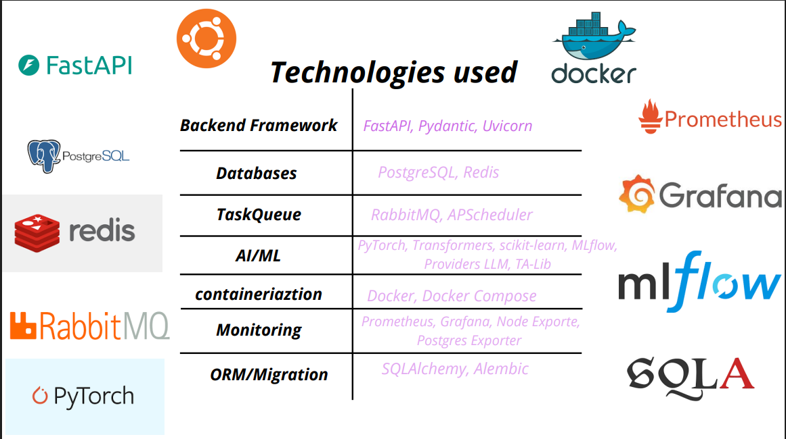

# Ai_Trading



Is an application for analyzing and executing trading strategies using a complete market data pipeline, machine learning models, technical indicators, and an LLM-based decision support module. The project follows a clean and modular architecture to ensure clear separation between data collection, analysis, prediction, and trading.

## Requirements

### Install Python using Miniconda

1. Download and install Miniconda from:  
   https://www.anaconda.com/docs/getting-started/miniconda/install#macos-linux-installation

2. Create a new environment:

   ```bash
   conda create -n Robot-Trading python=3.11
   ```

3. Activate the environment:
   ```bash
   conda activate Robot-Trading
   ```

_(Optional)_ Customize your terminal for better readability:

```bash
export PS1="\[\033[01;32m\][\u@\h:\w]\[\033[00m\]\n\$ "
```

## How It's Made:

**Tech used:** Python, Docker, Postgres, SQlAlchemy

## Configuration

### System Prerequisites

- **PostgreSQL**: Must be installed and the service started.
- **RabbitMQ**: Must be installed and the service started (preferably with the Management plugin enabled).
- **TA-Lib**: C library required for technical indicators.
  - _Windows_: Download the compatible `.whl` or install via `conda install -c conda-forge ta-lib` before pip.
  - _Linux_: `sudo apt-get install libta-lib0` (or compile from source).

### Database Configuration

1.  Create the PostgreSQL database:
    ```sql
    CREATE DATABASE "Ai_Trading";
    ```
2.  Apply migrations (table creation) via Alembic. The configuration is located in the `app/models/db_schemas/mini_Trading` subfolder:
    ```bash
    alembic -c app/models/db_schemas/mini_Trading/alembic.ini upgrade head
    ```

### Download Tools Configuration (Env Vars)

The application uses environment variables to connect to external APIs (Binance for market, NewsData for news).

Create a `.env` file at the root of `Ai_Trading/`:

```env
# --- Database ---
POSTGRES_USER=postgres
POSTGRES_PASSWORD=your_password
POSTGRES_HOST=localhost
POSTGRES_PORT=5432
POSTGRES_DBNAME=Ai_Trading

# --- Broker ---
RABBITMQ_DEFAULT_USER=guest
RABBITMQ_DEFAULT_PASS=guest
RABBITMQ_DEFAULT_VHOST=/

# --- Download APIs ---

# 1. Binance (Market Data)
# API keys for trading or private data (optional for public data)
BINANCE_API_KEY=your_binance_key
BINANCE_SECRET_KEY=your_binance_secret

# 2. NewsData.io (News/Sentiment Data)
# Required for the NewsCollector
NEWSDATA_API_KEY=your_newsdata_key
```

> **Note**: The collection scripts (`MarketDataCollector`, `NewsCollector`) are designed to run in the background or be instantiated by `main.py`. Ensure you have the necessary API credits.

## Launch

1. Install dependencies:

   ```bash
   pip install -r requirements.txt
   ```

2. Run the application:
   ```bash
   uvicorn main:app --reload
   ```

## Database Usage

The project uses **PostgreSQL** as the main database (named `Ai_Trading`).
The SQLAlchemy ORM is used in conjunction with **Alembic** for schema management (migrations).

- **Local connection**: You can connect to the database via any SQL client (such as DBeaver, pgAdmin, or DataGrip) using the credentials provided in your `.env` file (default: `postgres` user on `localhost:5432`).
- **Main tables**: The database stores historical data (OHLCV), pre-calculated technical indicators, ML model predictions history, as well as the history of trading decisions made by the LLM.

## APIs Usage (FastAPI)

The application exposes several RESTful endpoints. Once the application is started via `uvicorn`, you can test all the routes directly from the automatically generated interactive interface:
👉 **Swagger UI**: [http://localhost:8000/docs](http://localhost:8000/docs)
👉 **ReDoc**: [http://localhost:8000/redoc](http://localhost:8000/redoc)

### API Flow Diagram


### Main available routes:

#### 🔄 Streaming & Ingestion (WebSockets)

Manages the live data stream from the exchange (e.g., Binance).

- `POST /streaming/start`: Starts the continuous acquisition of market data in real-time.
- `POST /streaming/stop`: Cleanly stops the data stream.
- `GET /streaming/status`: Returns the current state of the streaming process.

#### 🧠 LLM Decision

Manages the interface with the generative Artificial Intelligence for trading.

- `GET /llm/context`: Retrieves the full snapshot of the current context (Current prices, RSI/MACD/etc. indicators, Current news sentiment, and the latest predictions). This is the context that is sent to the AI.
- `POST /llm/provider/{provider_name}`: Allows hot-swapping between different LLM models (e.g., Gemini, OpenAI) for decision-making.

#### 📈 Machine Learning Prediction (LSTM)

Manages inference via Deep Learning models.

- `POST /api/v1/lstm/predict`: Allows sending a temporal features vector (sequence) to the LSTM model to obtain a prediction on the future price trajectory.

---

## Docker Setup (Complete Infrastructure)

### Services Overview

The project includes a complete Docker stack to manage all infrastructure services (database, messaging, ML tracking, monitoring).

| Service | Description | Port | Web Access |
|---|---|---|---|
| **PostgreSQL** | Main database for OHLCV and decisions | `5432` | — |
| **RabbitMQ** | Message broker for the asynchronous pipeline | `5672` / `15672` | http://localhost:15672 |
| **MLflow** | Tracking and versioning of AI models | `5000` | http://localhost:5000 |
| **pgAdmin** | Web interface to manage PostgreSQL | `5050` | http://localhost:5050 |
| **Prometheus** | System and app metrics collection | `9090` | http://localhost:9090 |
| **Grafana** | Visualization dashboard for metrics and alerts | `3000` | http://localhost:3000 |
| **Node Exporter** | System metrics export (CPU, RAM, disk) | `9100` | — |
| **Postgres Exporter** | PostgreSQL metrics export | `9187` | — |

### 1. Environment Files Setup

Before launching Docker, create the environment files in `docker/env/`:

#### `docker/env/.env.postgres`
```env
POSTGRES_USER=postgres
POSTGRES_PASSWORD=your_secure_password
POSTGRES_DB=Ai_Trading
```

#### `docker/env/.env.rabbitmq`
```env
RABBITMQ_DEFAULT_USER=guest
RABBITMQ_DEFAULT_PASS=guest
RABBITMQ_DEFAULT_VHOST=/
```

#### `docker/env/.env.pgadmin`
```env
PGADMIN_DEFAULT_EMAIL=admin@example.com
PGADMIN_DEFAULT_PASSWORD=admin_password
```

#### `docker/env/.env.mlflow`
```env
MLFLOW_TRACKING_URI=postgresql://postgres:password@db:5432/Ai_Trading
MLFLOW_BACKEND_STORE_URI=postgresql://postgres:password@db:5432/Ai_Trading
MLFLOW_ARTIFACT_ROOT=/mlflow/artifacts
```

#### `docker/env/.env.grafana`
```env
GF_SECURITY_ADMIN_PASSWORD=admin_password
GF_INSTALL_PLUGINS=grafana-piechart-panel
```

#### `docker/env/.env.postgres-exporter`
```env
DATA_SOURCE_NAME=postgresql://postgres:password@db:5432/Ai_Trading?sslmode=disable
```

### 1.1 Quick creation of environment files

If you have `.env.example` files in the folder, create the configuration files by copying them:

```bash
# Go to the docker/env folder
cd docker/env

# Copy the example files to create the configuration files
cp .env.example.postgres .env.postgres
cp .env.example.rabbitmq .env.rabbitmq
cp .env.example.pgadmin .env.pgadmin
cp .env.example.mlflow .env.mlflow
cp .env.example.grafana .env.grafana
cp .env.example.postgres-exporter .env.postgres-exporter

# Edit each file with your sensitive values
# For example:
# nano .env.postgres
# nano .env.grafana
```

> **Important**: **Never** commit `.env` files (sensitive keys) to Git. Ensure they are in `.gitignore`.

### 2. Docker Stack Launch

#### 2.1 Full start with build

```bash
# Go to the docker folder (from the project root)
cd docker

# Start all services with image rebuild
docker compose up --build -d

# Check the containers state
docker compose ps

# Display logs in real-time (Ctrl+C to stop)
docker compose logs -f
```

#### 2.2 Simple start (without rebuild)

```bash
# If the images already exist
cd docker
docker compose up -d

# Quick check
docker compose ps
```

#### 2.3 Launch with Alembic (DB migrations)

If you use Alembic for migrations (the configuration is located in `app/models/db_schemas/mini_Trading`):

```bash
# Go to the project root
cd .

# Apply migrations after PostgreSQL is ready (if files are accessible there)
docker compose exec db alembic -c app/models/db_schemas/mini_Trading/alembic.ini upgrade head

# You can also do this from your local env
alembic -c app/models/db_schemas/mini_Trading/alembic.ini upgrade head
```

#### 2.4 Stop and cleanup

```bash
# Stop the services (keep the data)
docker compose stop

# Stop and remove the containers
docker compose down

# Also remove the volumes (WARNING: data loss!)
docker compose down -v

# Display the state
docker compose ps
```

### 3. Services Access

Once Docker is started, access the services via the following URLs:

| Service | URL | Credentials |
|---|---|---|
| **RabbitMQ Management** | http://localhost:15672 | guest / guest |
| **pgAdmin (PostgreSQL UI)** | http://localhost:5050 | admin@example.com / admin_password |
| **MLflow Tracking** | http://localhost:5000 | — |
| **Prometheus** | http://localhost:9090 | — |
| **Grafana Dashboard** | http://localhost:3000 | admin / admin_password |

### 4. Volume Management

Persistent data is stored in Docker **named volumes**:

```bash
# View all volumes
docker volume ls

# Inspect a volume (file locations)
docker volume inspect docker_postgres_data
docker volume inspect docker_mlflow_artifacts
docker volume inspect docker_grafana_data
docker volume inspect docker_prometheus_data
docker volume inspect docker_rabbitmq_data
```

#### Used Volumes

| Volume | Service | Stored Data |
|---|---|---|
| `postgres_data` | PostgreSQL | OHLCV tables, indicators, decisions |
| `mlflow_artifacts` | MLflow | AI models, metrics, run history |
| `grafana_data` | Grafana | Dashboards, datasources, configurations |
| `prometheus_data` | Prometheus | Collected historical metrics |
| `rabbitmq_data` | RabbitMQ | Messages, persistent queues |

#### Data Backup

```bash
# Export the PostgreSQL database
docker exec postgres_db pg_dump -U postgres Ai_Trading > backup_ai_trading.sql

# Backup the MLflow artifacts
docker run --rm -v docker_mlflow_artifacts:/mlflow alpine tar czf backup_mlflow_artifacts.tar.gz -C /mlflow artifacts

# Restore a database
docker exec -i postgres_db psql -U postgres Ai_Trading < backup_ai_trading.sql
```

### 5. Monitoring & Logs

```bash
# View logs for a specific service
docker compose logs -f postgres_db
docker compose logs -f mlflow
docker compose logs -f grafana

# Access a live database
docker exec -it postgres_db psql -U postgres -d Ai_Trading

# Test RabbitMQ connectivity
docker exec -it rabbitmq rabbitmq-diagnostics -q check_running
```

### 6. Docker Troubleshooting

**Error: "Port already in use"**
```bash
# List all applications using port 5432
netstat -ano | findstr :5432

# Change the service port in docker-compose.yml
# Ex: "5432:5432" → "5433:5432"
docker compose up -d
```

**Volumes are not syncing**
```bash
# Force container rebuild
docker compose down
docker volume prune -f
docker compose up -d --force-recreate
```

**Confusing or erroneous logs**
```bash
# Restart a specific service
docker compose restart postgres_db
docker compose restart mlflow
```
