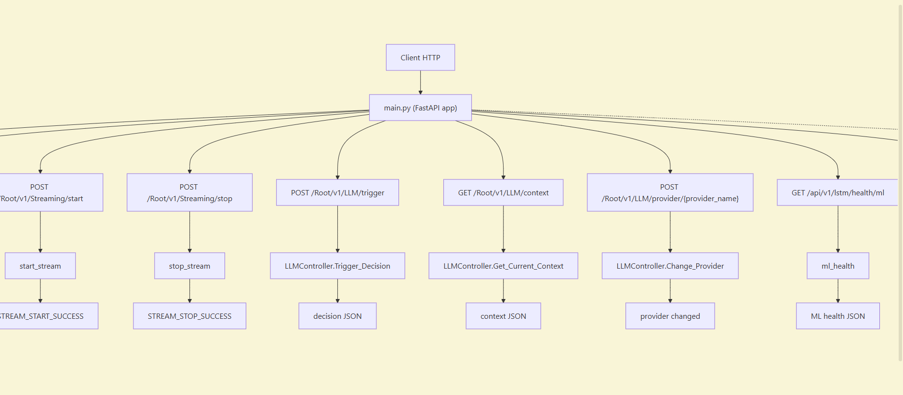

# Ai_Trading

Est une application d’analyse et d’exécution de stratégies de trading utilisant un pipeline complet de données de marché, des modèles de machine learning, des indicateurs techniques et un module d’aide à la décision basé sur LLM. Le projet suit une architecture propre et modulaire pour garantir une séparation claire entre la collecte des données, l’analyse, la prédiction et le trading.

## Exigences

### Installer Python en utilisant Miniconda

1. Téléchargez et installez Miniconda depuis :  
   https://www.anaconda.com/docs/getting-started/miniconda/install#macos-linux-installation

2. Créez un nouvel environnement :

   ```bash
   conda create -n Robot-Trading python=3.11
   ```

3. Activez l'environnement :
   ```bash
   conda activate Robot-Trading
   ```

_(Optionnel)_ Personnalisez votre terminal pour une meilleure lisibilité :

```bash
export PS1="\[\033[01;32m\][\u@\h:\w]\[\033[00m\]\n\$ "
```

## How It's Made:

**Tech used:** Python, Docker, Postgres,SQlAlchemy

## Configuration

### Pré-requis Système

- **PostgreSQL** : Doit être installé et le service démarré.
- **RabbitMQ** : Doit être installé et le service démarré (avec le plugin Management activé de préférence).
- **TA-Lib** : Librairie C nécessaire pour les indicateurs techniques.
  - _Windows_ : Télécharger le `.whl` compatible ou installer via `conda install -c conda-forge ta-lib` avant pip.
  - _Linux_ : `sudo apt-get install libta-lib0` (ou compiler depuis les sources).

### Configuration de la Base de Données

1.  Créer la base de données PostgreSQL :
    ```sql
    CREATE DATABASE "Ai_Trading";
    ```
2.  Appliquer les migrations (création des tables) via Alembic. La configuration se trouve dans le sous-dossier `app/models/db_schemas/mini_Trading` :
    ```bash
    alembic -c app/models/db_schemas/mini_Trading/alembic.ini upgrade head
    ```

### Configuration des Outils de Téléchargement (Env Vars)

L'application utilise des variables d'environnement pour se connecter aux APIs externes (Binance pour le marché, NewsData pour les infos).

Créez un fichier `.env` à la racine `Ai_Trading/` :

```env
# --- Base de Données ---
POSTGRES_USER=postgres
POSTGRES_PASSWORD=votre_mot_de_passe
POSTGRES_HOST=localhost
POSTGRES_PORT=5432
POSTGRES_DBNAME=Ai_Trading

# --- Broker ---
RABBITMQ_DEFAULT_USER=guest
RABBITMQ_DEFAULT_PASS=guest
RABBITMQ_DEFAULT_VHOST=/

# --- APIs de Téléchargement ---

# 1. Binance (Données de Marché)
# Clés API pour le trading ou les données privées (optionnel pour les données publiques)
BINANCE_API_KEY=votre_cle_binance
BINANCE_SECRET_KEY=votre_secret_binance

# 2. NewsData.io (Données d'Actualités/Sentiment)
# Nécessaire pour le NewsCollector
NEWSDATA_API_KEY=votre_cle_newsdata
```

> **Note** : Les scripts de collecte (`MarketDataCollector`, `NewsCollector`) sont conçus pour tourner en tâche de fond ou être instanciés par `main.py`. Assurez-vous d'avoir les crédits API nécessaires.

## Lancement

1. Installer les dependances :

   ```bash
   pip install -r requirements.txt
   ```

2. Lancer l'application :
   ```bash
   uvicorn main:app --reload
   ```

## Utilisation de la Base de Données

Le projet utilise **PostgreSQL** comme base de données principale (nommée `Ai_Trading`).
L'ORM SQLAlchemy est utilisé en conjonction avec **Alembic** pour la gestion des schémas (migrations).

- **Connexion locale** : Vous pouvez vous connecter à la base de données via n'importe quel client SQL (comme DBeaver, pgAdmin, ou DataGrip) en utilisant les identifiants fournis dans votre fichier `.env` (par défaut : utilisateur `postgres` sur `localhost:5432`).
- **Tables principales** : La base stocke les données historiques (OHLCV), les indicateurs techniques pré-calculés, l'historique des prédictions des modèles ML ainsi que l'historique des décisions de trading prises par le LLM.

## Utilisation des APIs (FastAPI)

L'application expose plusieurs endpoints RESTful. Une fois l'application lancée via `uvicorn`, vous pouvez tester toutes les routes directement depuis l'interface interactive générée automatiquement :
👉 **Swagger UI** : [http://localhost:8000/docs](http://localhost:8000/docs)
👉 **ReDoc** : [http://localhost:8000/redoc](http://localhost:8000/redoc)

### Schéma des flux API



### Principales routes disponibles :

#### 🔄 Streaming & Ingestion (WebSockets)

Gère le flux de données en direct depuis l'exchange (ex: Binance).

- `POST /streaming/start` : Lance l'acquisition continue des données du marché en temps réel.
- `POST /streaming/stop` : Arrête proprement le flux de données.
- `GET /streaming/status` : Retourne l'état actuel du processus de streaming.

#### 🧠 Décision LLM

Gère l'interface avec l'Intelligence Artificielle générative pour le trading.

- `GET /llm/context` : Récupère le snapshot complet du contexte actuel (Prix actuels, Indicateurs RSI/MACD/etc., Sentiment actuel des actualités, et les dernières prédictions). C'est ce contexte qui est envoyé à l'IA.
- `POST /llm/provider/{provider_name}` : Permet de basculer à chaud entre différents modèles LLM (ex: Gemini, OpenAI) pour la prise de décision.

#### 📈 Prédiction Machine Learning (LSTM)

Gère l'inférence via les modèles de Deep Learning.

- `POST /api/v1/lstm/predict` : Permet d'envoyer un vecteur de features temporelles (séquence) au modèle LSTM pour obtenir une prédiction sur la trajectoire future des prix.

---

## Docker Setup (Infrastructure Complète)

### Vue d'ensemble des Services

Le projet inclut une stack Docker complète pour gérer tous les services d'infrastructure (base de données, messaging, ML tracking, monitoring).

| Service | Description | Port | Accès Web |
|---|---|---|---|
| **PostgreSQL** | Base de données principale pour OHLCV et décisions | `5432` | — |
| **RabbitMQ** | Message broker pour le pipeline asynchrone | `5672` / `15672` | http://localhost:15672 |
| **MLflow** | Tracking et versioning des modèles IA | `5000` | http://localhost:5000 |
| **pgAdmin** | Interface Web pour gérer PostgreSQL | `5050` | http://localhost:5050 |
| **Prometheus** | Collecte des métriques système et app | `9090` | http://localhost:9090 |
| **Grafana** | Visualization dashboard for metrics et alertes | `3000` | http://localhost:3000 |
| **Node Exporter** | Export des métriques système (CPU, RAM, disque) | `9100` | — |
| **Postgres Exporter** | Export des métriques PostgreSQL | `9187` | — |

### 1. Setup des Fichiers d'Environnement

Avant de lancer Docker, créez les fichiers d'environnement dans `docker/env/` :

#### `docker/env/.env.postgres`
```env
POSTGRES_USER=postgres
POSTGRES_PASSWORD=votre_mot_de_passe_secure
POSTGRES_DB=Ai_Trading
```

#### `docker/env/.env.rabbitmq`
```env
RABBITMQ_DEFAULT_USER=guest
RABBITMQ_DEFAULT_PASS=guest
RABBITMQ_DEFAULT_VHOST=/
```

#### `docker/env/.env.pgadmin`
```env
PGADMIN_DEFAULT_EMAIL=admin@example.com
PGADMIN_DEFAULT_PASSWORD=admin_password
```

#### `docker/env/.env.mlflow`
```env
MLFLOW_TRACKING_URI=postgresql://postgres:mot_de_passe@db:5432/Ai_Trading
MLFLOW_BACKEND_STORE_URI=postgresql://postgres:mot_de_passe@db:5432/Ai_Trading
MLFLOW_ARTIFACT_ROOT=/mlflow/artifacts
```

#### `docker/env/.env.grafana`
```env
GF_SECURITY_ADMIN_PASSWORD=admin_password
GF_INSTALL_PLUGINS=grafana-piechart-panel
```

#### `docker/env/.env.postgres-exporter`
```env
DATA_SOURCE_NAME=postgresql://postgres:mot_de_passe@db:5432/Ai_Trading?sslmode=disable
```

### 1.1 Création rapide des fichiers d'environnement

Si vous avez des fichiers `.env.example` dans le dossier, créez les fichiers de configuration en les copiant :

```bash
# Accédez au dossier docker/env
cd docker/env

# Copiez les fichiers d'exemple pour créer les fichiers de configuration
cp .env.example.postgres .env.postgres
cp .env.example.rabbitmq .env.rabbitmq
cp .env.example.pgadmin .env.pgadmin
cp .env.example.mlflow .env.mlflow
cp .env.example.grafana .env.grafana
cp .env.example.postgres-exporter .env.postgres-exporter

# Éditez chaque fichier avec vos valeurs sensibles
# Par exemple :
# nano .env.postgres
# nano .env.grafana
```

> **Important** : Ne commitez **jamais** les fichiers `.env` (clés sensibles) dans Git. Assurez-vous qu'ils sont dans `.gitignore`.

### 2. Lancement de la Stack Docker

#### 2.1 Démarrage complet avec build

```bash
# Position-toi dans le dossier docker (depuis la racine du projet)
cd docker

# Démarre tous les services avec rebuild des images
docker compose up --build -d

# Vérifie l'état des conteneurs
docker compose ps

# Affiche les logs en temps réel (Ctrl+C pour arrêter)
docker compose logs -f
```

#### 2.2 Démarrage simple (sans rebuild)

```bash
# Si les images existent déjà
cd docker
docker compose up -d

# Vérification rapide
docker compose ps
```

#### 2.3 Lancement avec Alembic (migrations DB)

Si vous utilisez Alembic pour les migrations (la configuration se trouve dans `app/models/db_schemas/mini_Trading`) :

```bash
# Accédez à la racine du projet
cd .

# Appliquez les migrations après que PostgreSQL soit prêt (si les fichiers y sont accessibles)
docker compose exec db alembic -c app/models/db_schemas/mini_Trading/alembic.ini upgrade head

# Vous pouvez aussi faire ça depuis votre env local
alembic -c app/models/db_schemas/mini_Trading/alembic.ini upgrade head
```

#### 2.4 Arrêt et nettoyage

```bash
# Arrête les services (garde les données)
docker compose stop

# Arrête et supprime les conteneurs
docker compose down

# Supprime aussi les volumes (ATTENTION : perte de données !)
docker compose down -v

# Affiche l'état
docker compose ps
```

### 3. Accès aux Services

Une fois Docker démarré, accéde aux services via les URLs suivantes :

| Service | URL | Identifiants |
|---|---|---|
| **RabbitMQ Management** | http://localhost:15672 | guest / guest |
| **pgAdmin (PostgreSQL UI)** | http://localhost:5050 | admin@example.com / admin_password |
| **MLflow Tracking** | http://localhost:5000 | — |
| **Prometheus** | http://localhost:9090 | — |
| **Grafana Dashboard** | http://localhost:3000 | admin / admin_password |

### 4. Volume Management

Les données persistantes sont stockées dans des **volumes nommés** Docker :

```bash
# Voir tous les volumes
docker volume ls

# Inspecter un volume (emplacements des fichiers)
docker volume inspect docker_postgres_data
docker volume inspect docker_mlflow_artifacts
docker volume inspect docker_grafana_data
docker volume inspect docker_prometheus_data
docker volume inspect docker_rabbitmq_data
```

#### Volumes Utilisés

| Volume | Service | Données Stockées |
|---|---|---|
| `postgres_data` | PostgreSQL | Tables OHLCV, indicateurs, décisions |
| `mlflow_artifacts` | MLflow | Modèles IA, métriques, run history |
| `grafana_data` | Grafana | Dashboards, datasources, configurations |
| `prometheus_data` | Prometheus | Métriques historiques collectées |
| `rabbitmq_data` | RabbitMQ | Messages, queue persistantes |

#### Backup des Données

```bash
# Exporter la base de données PostgreSQL
docker exec postgres_db pg_dump -U postgres Ai_Trading > backup_ai_trading.sql

# Sauvegarder les artefacts MLflow
docker run --rm -v docker_mlflow_artifacts:/mlflow alpine tar czf backup_mlflow_artifacts.tar.gz -C /mlflow artifacts

# Restaurer une base de données
docker exec -i postgres_db psql -U postgres Ai_Trading < backup_ai_trading.sql
```

### 5. Monitoring & Logs

```bash
# Voir les logs d'un service spécifique
docker compose logs -f postgres_db
docker compose logs -f mlflow
docker compose logs -f grafana

# Accéder à une base de données en direct
docker exec -it postgres_db psql -U postgres -d Ai_Trading

# Tester la connectivité RabbitMQ
docker exec -it rabbitmq rabbitmq-diagnostics -q check_running
```

### 6. Troubleshooting Docker

**Erreur : "Port already in use"**
```bash
# Liste toutes les applications utilisant le port 5432
netstat -ano | findstr :5432

# Change le port du service dans docker-compose.yml
# Ex: "5432:5432" → "5433:5432"
docker compose up -d
```

**Les volumes ne se synchronisent pas**
```bash
# Force la reconstruction des conteneurs
docker compose down
docker volume prune -f
docker compose up -d --force-recreate
```

**Logs confus ou erronés**
```bash
# Redémarre un service spécifique
docker compose restart postgres_db
docker compose restart mlflow
```
